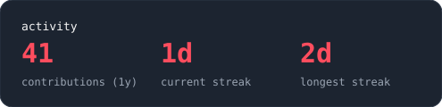
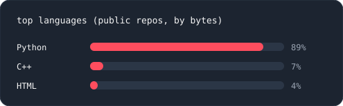

[github](https://github.com/[your-username]) &nbsp;·&nbsp;
[linkedin](https://www.linkedin.com/in/[your-linkedin]) &nbsp;·&nbsp;
[email](mailto:[your-email])

> B.Tech CSE student at YMCA (J.C. Bose University), Faridabad. 
> Think like the attacker, build like the defender.

I learn by building small, working tools and then breaking them to see how they fail. 
Right now I'm working on web fundamentals and getting industry-ready in cybersecurity.

<samp>html &nbsp; css &nbsp; javascript &nbsp; git &nbsp; linux &nbsp; [add what you actually use]</samp>

**[wallet-app](https://github.com/[your-username]/wallet-app)** &nbsp;·&nbsp; <samp>html, css, javascript</samp> 
Wallet tracker with a step-based amount selector, a finger counter, and a 
transaction history saved in the browser, shown 5 at a time with "show more".

**[project-2](https://github.com/[your-username]/[repo])** &nbsp;·&nbsp; <samp>[tech]</samp> 
[One line: what it does and the problem it solves.]

**[project-3](https://github.com/[your-username]/[repo])** &nbsp;·&nbsp; <samp>[tech]</samp> 
[One line.]

Every graphic here is generated, not embedded from anyone else's server. 
The stat graphics and these section headings are drawn by 
[a scheduled action](.github/workflows/stats.yml) straight from the GitHub API, 
once a day, committing only what changed.

Language totals cover public repositories only. `year.svg` draws one character 
per day: `:` `+` `#` `@`, quiet to loud.
